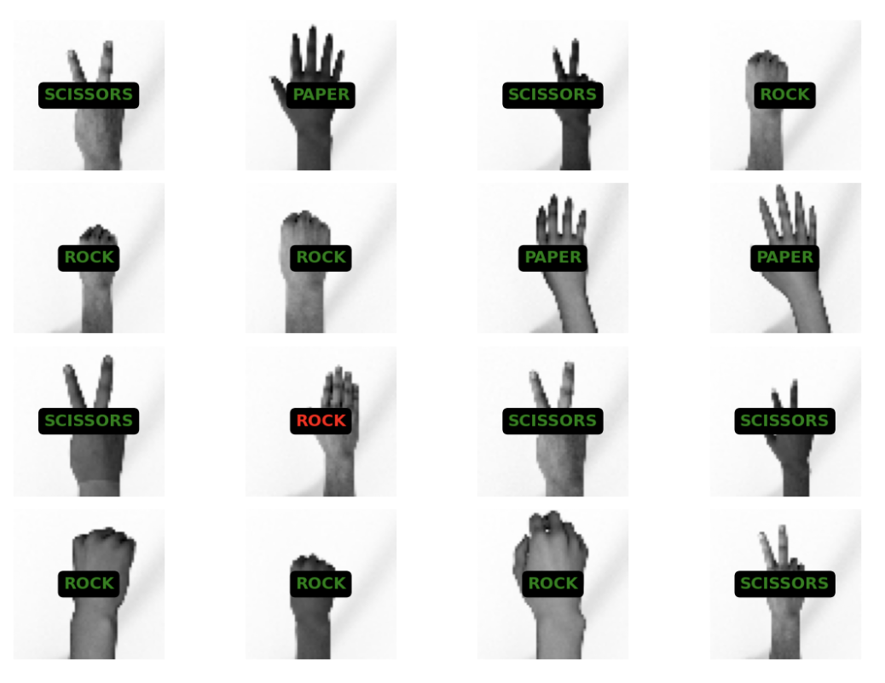
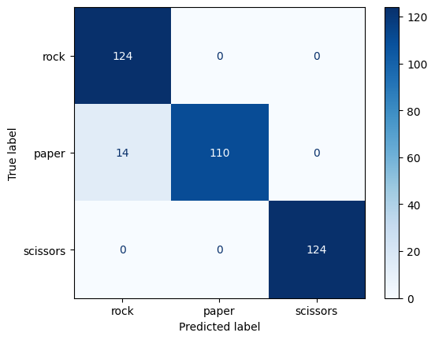

# CNN para clasificar gestos de piedra, papel o tijera

> 🚀 **Proyecto personal de aprendizaje sobre redes neuronales convolucionales (CNN)**

Este repositorio contiene un notebook desarrollado con el objetivo de aprender y practicar conceptos de clasificación de imágenes, utilizando redes convolucionales.

El proyecto se basa en el conjunto de datos *Rock-Paper-Scissors* de [TensorFlow Datasets](https://www.tensorflow.org/datasets/catalog/rock_paper_scissors).

---

## 📂 Contenido del repositorio

| Archivo | Descripción |
|----------|--------------|
| `rock-paper-scissors.ipynb` | Notebook principal con todo el proceso de entrenamiento, validación y análisis de resultados. |
| `data/predictions.pdf`| PDF con los resultados visuales del modelo. |

---

## 📊 Resultados y observaciones

  
  

El modelo alcanza un buen rendimiento general, con una exactitud cercana al 96% (puede variar entre ejecuciones).

A través de la matriz de confusión se ha visto que el modelo tiende a confundir algunos gestos de 'papel' con 'piedra'. Al analizar el PDF generado en `data/predictions.pdf` se observa que esta confusión ocurre cuando los dedos del gesto 'papel' aparecen muy juntos. El modelo parece asociar 'papel' con la separación entre dedos.

---

## ⚙️ Tecnologías utilizadas

- Python 
- Docker  
- Jupyter Notebook  
- **TensorFlow**  
- NumPy  
- Matplotlib
